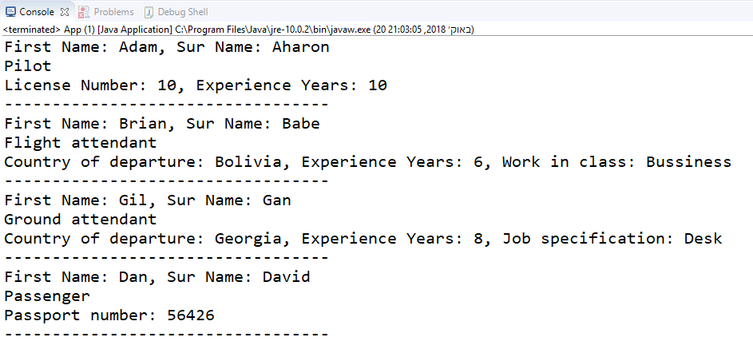

# HomeWork 10/10/2018
## Airline
***

In this project I've created an simulation of an airline. It has Pilot, Flight attendant, Ground attendant, and passanger.
I've created a Person Class to hold the mutual proporties and super.print().

### Classes

* **Person** - defines the names, G&S's, CTOR and method.
1. print() -prints info of Person names.

* **Pilot** - defines the Pilots license number,	experience, G&S's, CTOR and method.
1. print() -prints Pilots info and call o super (Person) to print name info.

* **Passenger** - defines the Passenger Passport number, G&S's, CTOR and method.
1. print() -prints Passenger info and call o super (Person) to print name info.

* **LandStu** - defines the Ground attendant Job title, Country,	experience, G&S's, CTOR and method.
1. print() -prints Ground attendant info and call o super (Person) to print name info.

* **AirStu** - defines the Flight attendant Working class, Country,	experience, G&S's, CTOR and method.
1. print() -prints Flight attendant info and call o super (Person) to print name info.

### Result Image

***
 ### Author
 Dan Avraham
danavraham@gmail.com

