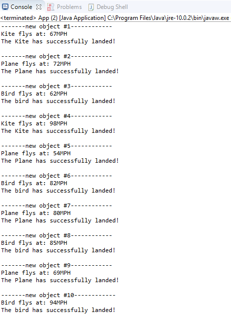

# ClassWork 21/10/2018
## Interface
***

In this project I've used interface. The interface is IFly.
There are 3 classes of flying items- Bird, Kite and a Plane.

### Interfaces
* **IFly** - define actions void fly (int speed) & boolean isLand();

### Classes

* **kite** - implements IFly interface
defines - price, color and G&S's for them.
1. fly() -@Override the fly method of IFly and prints birds flight speed.
2. isLandand() -@Override the isLand method of IFly and prints that it has landed and return true.

* **Bird** - implements IFly interface
defines - birdType, age, color and G&S's for them.
1. fly() -@Override the fly method of IFly and prints birds flight speed.
2. isLandand() -@Override the isLand method of IFly and prints that it has landed and return true.

* **Plane** - implements IFly interface
defines - name, airline, destination and G&S's for them.
1. fly() -@Override the fly method of IFly and prints birds flight speed.
2. isLandand() -@Override the isLand method of IFly and prints that it has landed and return true.

* **App** - defines an Array of 10 "IFlys", and sends each pointer to createIFly() to get a new IFly object from it.
than it sends each oject to get its random flight speed, and then it sends an order to land.
1. createSpeed() -returns a random speed.
1. createIFly() -returns a random IFly.

### Result Image

***
 ### Author
 Dan Avraham
danavraham@gmail.com

