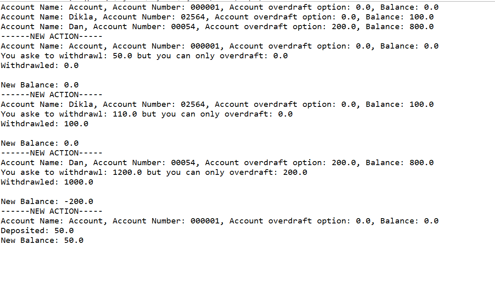

# HomeWork I 24/10/2018
## Bank Account
***

In this project I've created a bank acount. I created 2 Classes, Bankaccount and TestBankAccount- to check it.

### Classes

* **Bankaccount** - 
defines - accountName, accountNum, balance, isOverDraftAllowd, overDraftSum.
In addition- default and non-default constractors and G&S's for the Properties.
1. deposit() -Checks if the amount deposited is positive, ad if it is- adds it to the balance and prints the action and new balance.
2. withdrawlOption() -Checks the total option of withdrawl- Balance+Overdraft option.
3. withdrawl() -Checks if the withdrawl request is lower than the withdrawlOption and withdrawl the appropriate amount accordinly, than prints action and new balance.
4. toString() -@Override the toString method and prints account details.

* **TestBankAccount** - defines an Array of 3 BankAccounts and sets one to default CTOR, and another 2.
than it prints the initial info and makes some actions on the bank accounts.

### Result Image

***
 ### Author
 Dan Avraham
danavraham@gmail.com

