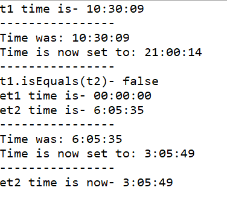

# HomeWork II 24/10/2018
## Clock
***

In this project I've created a Clock module. I created 3 Classes, SimpleTime, ExtentedTime and App- to check it.

### Classes

* **SimpleTime** - 
defines - hour, minute, second.
In addition- default and non-default constractors and G&S's for the Properties which defines range of the times.
1. setTime() -Gets 3 ints and set the time by them.
2. addHour() -Gets an int of an hour to add, checs the logic of adding the hours and returns the new hour time.
2. addMinute() -Gets an int of a Minute to add, checs the logic of adding the Minutes and returns the new Minute time.
2. addSecond() -Gets an int of a Second to add, checs the logic of adding the Seconds and returns the new Second time.
3. tick()- Sends to addSecond() to add 1 second.
4. add()- Gets an SimpleTime object to add to current object time, adds them and prints time befor and after adding.
5. isEquals()- Gets an SimpleTime object to check if it equals to the urrent object time, and return true or false;
6. toString() -@Override the toString method and returns time details on a HH:MM:SS format.

* **ExtentedTime** - extends SimpleTime 
defines - is24Hours true for 24H format, false for 12H format.
In addition- default and non-default constractors and G&S's for the Properties.
1. toString() -@Override the toString method and prints atime for selected format 24H/12H.

* **App** - defines few times and check the Classes

### Result Image

***
 ### Author
 Dan Avraham
danavraham@gmail.com

