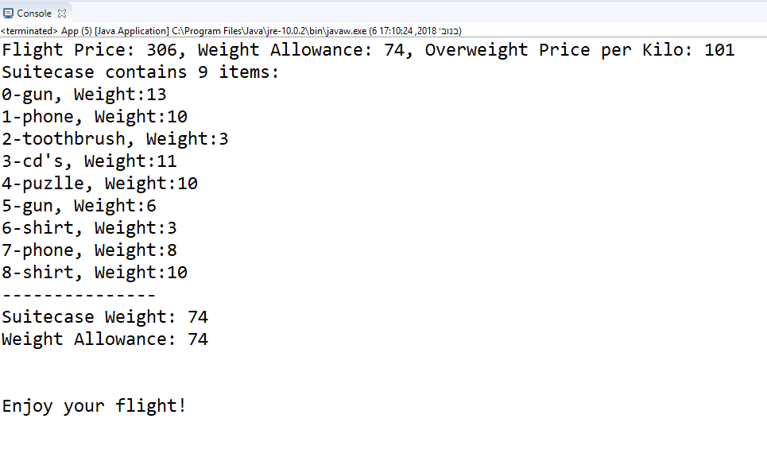
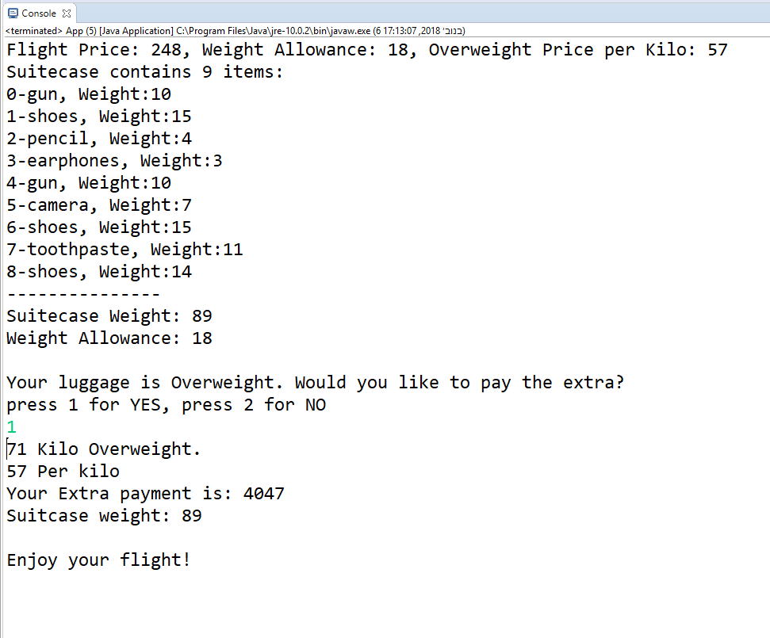
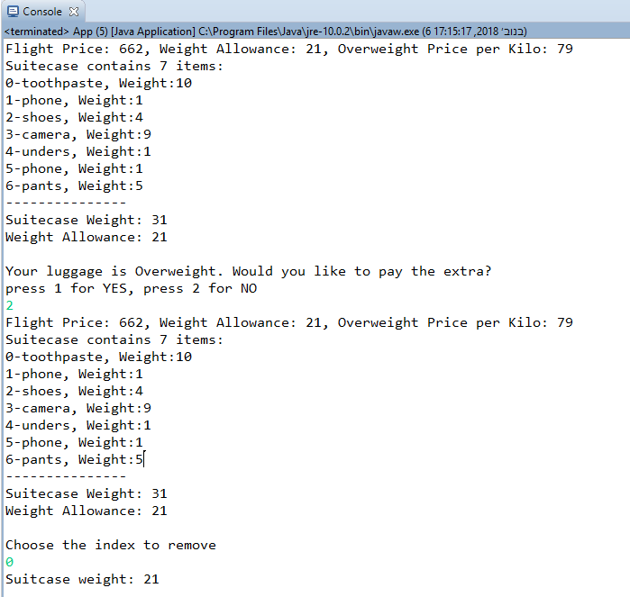

# HomeWork I 04/10/2018
## Flight
***

In this project I've created a passanger with suitcase, that checks the over weight and gives sulotions. I created 3 Classes, Passanger, Suitcase, Product and an App.

### Classes

* **Product** - 
defines - weight, weight.
In addition-  non-default constractor and G&S's for the Properties.

* **Suitcase** -
defines an ArrayList of products and suitcase weight.
In addition-  constractor that create the new ArrayList and G&S's for the Properties, the getSuitcaseWeight() sums th products weight in the suitcase.
1. addProduct() -gets a product and adds it to the list in the suitcase.
2. override toString() -create string of the products + weights, and total weight.

* **Passanger** - 
defines - flightPrice, weightAllowance, suitecase, kiloPriceOverweight.
In addition- constractor and G&S's for the Properties.
1. ovrride toString() -@Override the toString method and prints passanger details, number of items, suitcase products and weight allowance.

* **App** - 
Method getRandom()- create random numbers between min and max.
Sends to random flight price, weight allowance, price for overweight per kilo, number of items in suitcase and random product from array and thir prices.
defines an array of 20 products.
the App checks if the suitcase weights is in the limit of the weight allowance.
if it is not- askes to choose if to pay for the extra or not.
if the passanger wishes to pay, he gets the amount, if not- he gets the list of products and asked to choose which one to remove.
When the weight it in the approved rane, the loop stops. 
Than it wishes Enjoy your flight!

### Result Image when weight in range

### Result Image when weight not in range, and passanger choose to pay

### Result Image when weight not in range and passanger choose not to pay

***
 ### Author
 Dan Avraham
danavraham@gmail.com

