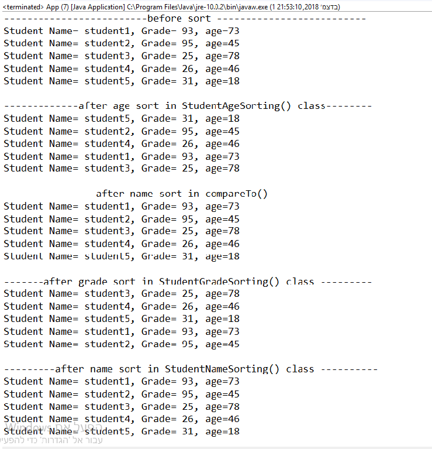

# HomeWork 28/11/2018
## Sort Options- Students
***

In this project I've created a lisst of students tat can be sortes by few params.
I created 2 options to sort the ArrayList by name. one inside the Student class- by compareTo(), and second in external StudentAgeSort class.

### Classes

* **Student** - defines the name, grade and age, G&S's (with restrictions for the age and grade), CTOR and method.
1. @Override of toString() to get the student entire info.
2. @Override of compareTo() to sort the sStudent ArrayList by name.

* **StudentAgeSorting** - implements Comparator<> and sorts students Arraylist by Age.

* **StudentGradeSorting** - implements Comparator<> and sorts students Arraylist by Grade.

* **StudentNameSorting** - implements Comparator<> and sorts students Arraylist by Name.

* **App** - defines an ArrayList of "Student" named "students", and inserts 5 Student objects to it using rand() method to generat age and grade.
The App prints (in a loop) the Array list after every sort type.
1. rand() -gets min and max values and generate a value between them using Math.random().

### Result Image

***
 ### Author
 Dan Avraham
danavraham@gmail.com

